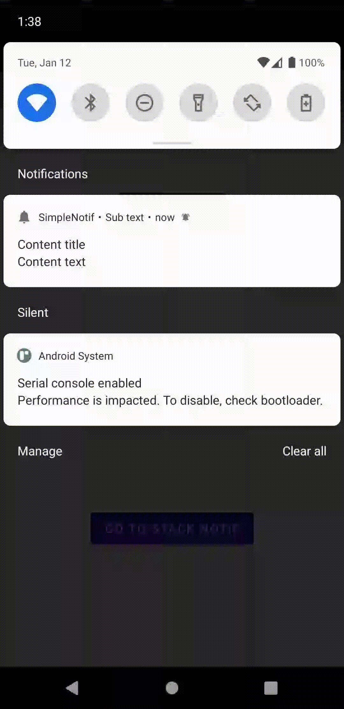

## About This Project

- SDK for your notification problem to make easier developing android apps
- frogo-notification is under huge large development
- Notification with singleton method
- Simple and eazy to use
- With many feature
- Full documentation

## Screenshoot Library Sample
Simple Notification |   Custom Notification |   Stack Notification |
:------------------:|:---------------------:|:---------------------:|
 |  |  |

## Version Release
This Is Latest Release

    $version_release = 1.0.5

What's New??

    * Bug Fixed *
    * Enhance Performance *
    * Update : build.gradle latest version *

## Download this project

### Step 1. Add the JitPack repository to your build file (build.gradle : Project)

    Add it in your root build.gradle at the end of repositories:

    	allprojects {
    		repositories {
    			...
    			maven { url 'https://jitpack.io' }
    		}
    	}

### Step 2. Add the dependency (build.gradle : Module)

    dependencies {
            // library frogo-notification
            implementation 'com.github.amirisback:frogo-notification:1.0.5'
    }

### Step 3. Implement frogo-notification (Simple Notification)

    FrogoNotification.Inject(this) // Intialize for Context
        .setChannelId(CHANNEL_ID) // Intialize for Channel ID
        .setChannelName(CHANNEL_NAME) // Initialize for Channel Name
        .setContentIntent(pendingIntent) // Initialize for Content Intent
        .setSmallIcon(R.drawable.ic_frogo_notif) // Initialize for Small Icon
        .setLargeIcon(R.drawable.ic_frogo_notif) // Initialize for Large Icon
        .setContentTitle(resources.getString(R.string.content_title)) // Initialize for Content Title
        .setContentText(resources.getString(R.string.content_text)) // Initialize for Content Text
        .setSubText(resources.getString(R.string.subtext)) // Initialize for Sub Text
        .setAutoCancel(true) // Initialize for Auto Cancel
        .build() // Build the Frogo Notification
        .launch(NOTIFICATION_ID) // Notify the Frogo Notification

## Feature frogo-notification

### Simple Notification

    FrogoNotification.Inject(this) // Intialize for Context
        .setChannelId(CHANNEL_ID) // Intialize for Channel ID
        .setChannelName(CHANNEL_NAME) // Initialize for Channel Name
        .setContentIntent(pendingIntent) // Initialize for Content Intent
        .setSmallIcon(R.drawable.ic_frogo_notif) // Initialize for Small Icon
        .setLargeIcon(R.drawable.ic_frogo_notif) // Initialize for Large Icon
        .setContentTitle(resources.getString(R.string.content_title)) // Initialize for Content Title
        .setContentText(resources.getString(R.string.content_text)) // Initialize for Content Text
        .setSubText(resources.getString(R.string.subtext)) // Initialize for Sub Text
        .setAutoCancel(true) // Initialize for Auto Cancel
        .build() // Build the Frogo Notification
        .launch(NOTIFICATION_ID) // Notify the Frogo Notification

### With Action Replay

    FrogoNotification.Inject(this)
        .setChannelId(CHANNEL_ID)
        .setChannelName(CHANNEL_NAME as String)
        .setSmallIcon(R.drawable.ic_frogo_notif)
        .setContentTitle(getString(R.string.notif_title))
        .setContentText(getString(R.string.notif_content))
        .showWhen(true)
        .setupActionRemoteInput(object : IFNActionRemoteInput {
            override fun setRemoteInputResultKey(): String {
                return KEY_REPLY
            }

            override fun setRemoteInputLabel(): String {
                return getString(R.string.notif_action_reply)
            }

            override fun setActionIcon(): Int {
                return R.drawable.ic_frogo_send
            }

            override fun setActionTitle(): String {
                return getString(R.string.notif_action_reply)
            }

            override fun setActionIntent(): PendingIntent? {
                return getReplyPendingIntent()
            }

            override fun setAllowGeneratedReplies(): Boolean {
                return true
            }
        })
        .build()
        .launch(mNotificationId)

### With Inbox Style (Stack)

    val frogoNotification = FrogoNotification.Inject(this)
        .setChannelId(CHANNEL_ID)
        .setChannelName(CHANNEL_NAME)
        .setSmallIcon(R.drawable.ic_frogo_email)
        .setGroup(GROUP_KEY_EMAILS)
        .setContentIntent(pendingIntent)
        .setAutoCancel(true)

    // Check if NotificationID is smaller than Max Notif
    if (idNotification < MAX_NOTIFICATION) {

        stackNotif[idNotification].message?.let {
            frogoNotification
                .setContentTitle("New Email from " + stackNotif[idNotification].sender)
                .setContentText(it)
                .setLargeIcon(R.drawable.ic_frogo_notif)
        }

    } else {

        frogoNotification
            .setContentTitle("$idNotification new emails")
            .setContentText("mail@frogobox.com")
            .setGroupSummary()
            .setupInboxStyle(object : IFNInboxStyle {
                override fun addLine1(): String {
                    return "New Email from " + stackNotif[idNotification].sender
                }

                override fun addLine2(): String {
                    return "New Email from " + stackNotif[idNotification - 1].sender
                }

                override fun setBigContentTitle(): String {
                    return "$idNotification new emails"
                }

                override fun setSummaryText(): String {
                    return "mail@frogobox"
                }
            })

    }

    frogoNotification
        .build()
        .launch(idNotification)

### With Frogo Style

        FrogoNotification.Inject(this) // Intialize for Context
            .setSmallIcon(R.drawable.ic_frogo_notif) // Initialize for Small Icon
            .setupWithFrogoStyle()
            .build() // Build the Frogo Notification
            .launch(NOTIFICATION_ID) // Notify the Frogo Notification

### For Documentation

- Method with description [Click Here](https://github.com/amirisback/frogo-notification/blob/master/frogonotification/src/main/java/com/frogobox/frogonotification/IFrogoNotification.kt)
- Simple Notification [Click Here](https://github.com/amirisback/frogo-notification/blob/master/app/src/main/java/com/frogobox/notification/simple/MainActivity.kt)
- With Action Replay [Click Here](https://github.com/amirisback/frogo-notification/blob/master/app/src/main/java/com/frogobox/notification/custom/NotificationService.kt)
- With Inbox Style (Stack) [Click Here](https://github.com/amirisback/frogo-notification/blob/master/app/src/main/java/com/frogobox/notification/stack/StackNotifActivity.kt)

## Colaborator
Very open to anyone, I'll write your name under this, please contribute by sending an email to me

- Mail To faisalamircs@gmail.com
- Subject : Github _ [Github-Username-Account] _ [Language] _ [Repository-Name]
- Example : Github_amirisback_kotlin_admob-helper-implementation

Name Of Contribute
- Muhammad Faisal Amir
- Waiting List
- Waiting List

Waiting for your contribute

## Attention !!!
- Please enjoy and don't forget fork and give a star
- Don't Forget Follow My Github Account
